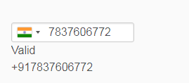

# Angular 2+ wrapper for intl-tel-input

# Installation

Run following command to install ng2-tel-input

```sh
npm install ng2-tel-input intl-tel-input --save
```

After install, you need to add **intlTelInput.css**, **intlTelInput.min.js**, **utils.js**.

In case of @angular/cli, add 3 files in your `angular.json`. 

For example,

- Include **intlTelInput.css** in "styles" at your `angular.json` file  :
```
  "styles": [
    ...
    "node_modules/intl-tel-input/build/css/intlTelInput.css",
    ...
  ]
```

- Include **intlTelInput.min.js**, **utils.js** in "scripts" at your `angular.json` file  :
```
  "scripts": [
    ...
    "node_modules/intl-tel-input/build/js/intlTelInput.min.js",
    "node_modules/intl-tel-input/build/js/utils.js",
    ...
  ]
```


Now add Ng2TelInputModule into your AppModule. For example,

```js
import {Ng2TelInputModule} from 'ng2-tel-input';
```

Once done, we are ready to use this library.

# How to use?

In order to use this directive, you need to add "ng2TelInput" directive with "[ng2TelInputOptions]" options to your text field. For example,

```html
<input type="text"
  ng2TelInput
  [ng2TelInputOptions]="{initialCountry: 'in'}"
  (hasError)="hasError($event)"
  (ng2TelOutput)="getNumber($event)"
  (intlTelInputObject)="telInputObject($event)"
  (countryChange)="onCountryChange($event)" />
```

# Note
**(intlTelInputObject)** returns **intl-tel-input** instance.

# How to use this instance?
You can use it perform any functionality that is available on intl-tel-input plugin. **For example**, in your component,
```
telInputObject(obj) {
    console.log(obj);
    obj.setCountry('in');
  }
```


